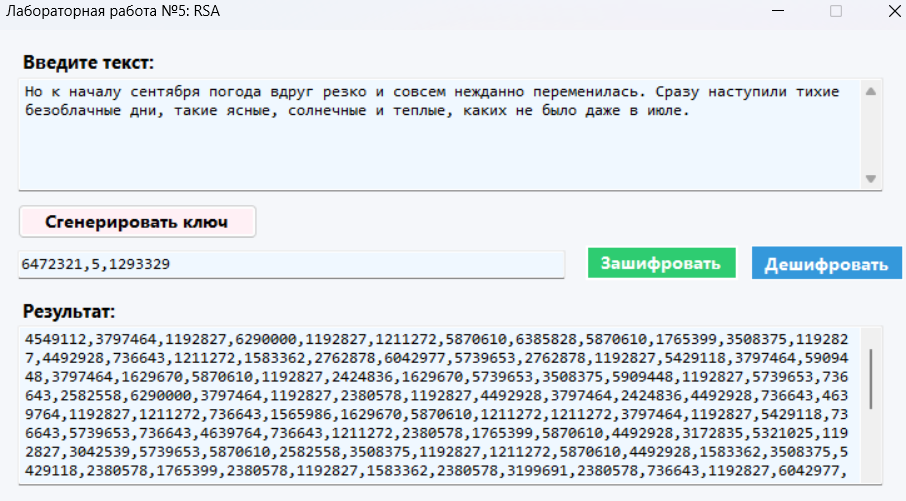
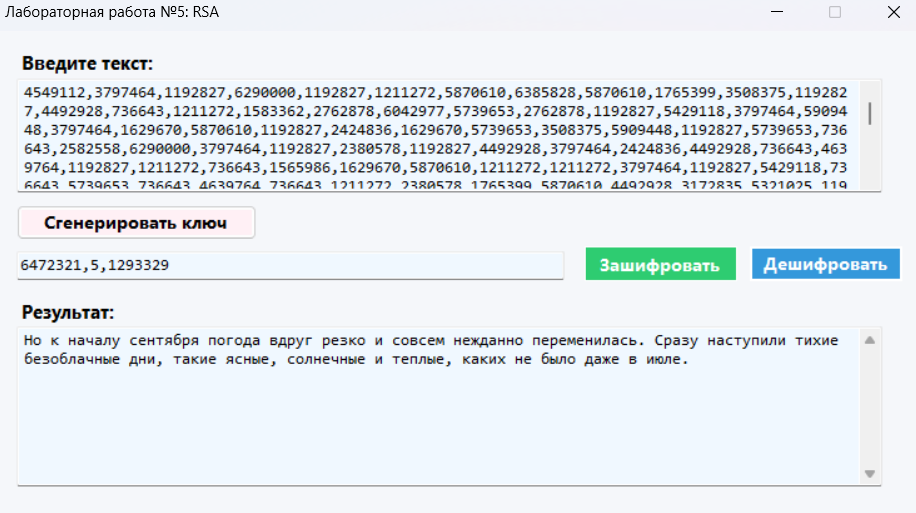

# RSA Шифрование

## Описание
Данный проект представляет собой веб-приложение для шифрования и дешифрования текста с использованием алгоритма RSA. Приложение разработано на C# (.NET 8.0).

## Краткое описание метода шифрования
RSA (Rivest–Shamir–Adleman) - это асимметричный алгоритм шифрования, использующий пару ключей:
- Публичный ключ (n, e) для шифрования
- Приватный ключ (n, d) для дешифрования

где:
- n - произведение двух простых чисел
- e - открытая экспонента  
- d - секретная экспонента

Ключи в приложении выводятся в формате: `n,e,d`

## Запуск проекта

Для запуска проекта выполните следующие шаги:

1. Убедитесь, что у вас установлен .NET 8.0 SDK
2. Откройте терминал и перейдите в корневую директорию проекта
3. Выполните команду: dotnet run

## Возможности веб-интерфейса
- Генерация ключевой пары RSA
- Шифрование введенного текста с помощью публичного ключа
- Дешифрование текста с помощью приватного ключа
- Сохранение/загрузка существующих ключей

## Примеры использования

### Шифрование текста
1. Сгенерируйте новую пару ключей кнопкой "Сгенерировать ключ"
2. Введите текст для шифрования
3. Нажмите "Зашифровать"

### Дешифрование текста  
1. Введите зашифрованный текст
2. Укажите правильный ключ
3. Нажмите "Дешифровать"

## Скриншоты

### Шифрование текста

### Дешифрование текста
