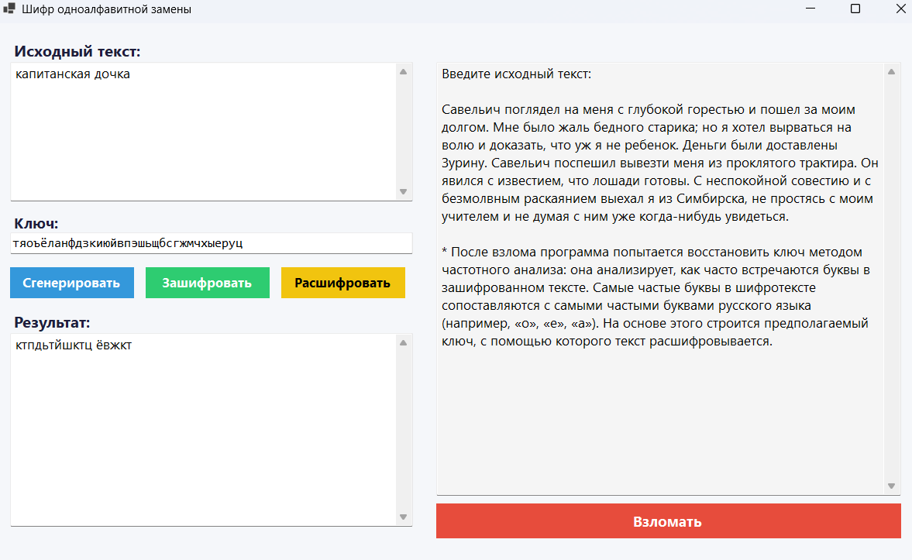
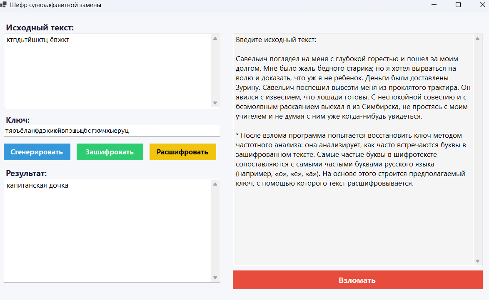
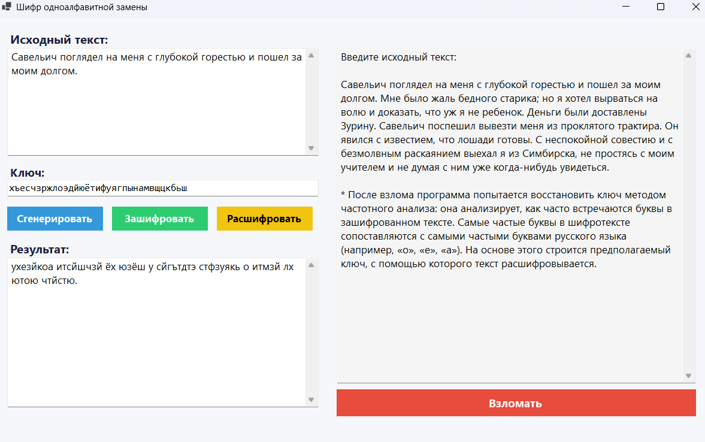
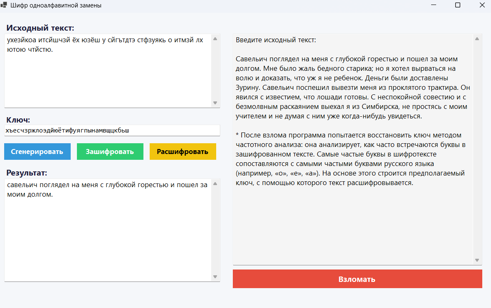
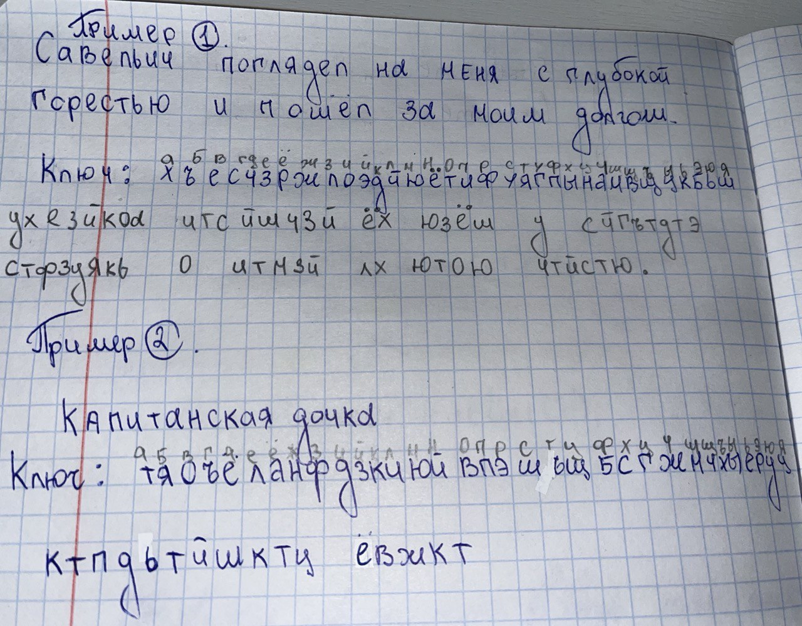

# Шифр Одноалфавитной замены

## Описание
Данная лабораторная работа демонстрирует шифрование методом Одноалфавитной замены. 

## Краткое описание метода шифрования Одноалфавитной замены
Шифр подстановки - это метод шифрования, в котором элементы исходного открытого текста заменяются зашифрованным текстом в соотвествие с некоторым правилом. Элементами текста могут быть отдельные символы: пары букв, тройки букв, комбинирование этих случаев и другие. В нашем случае используется один из типов - Одноалфавитный шифр подстановки (шифр простой замены). Каждый символ открытого текста заменяется на некоторый, фиксированный при данном ключе символ, того же алфавита.

## Запуск проекта
Для запуска проекта выполните следующие шаги:

1. Убедитесь, что у вас установлен .NET 8.0 SDK.
2. Откройте терминал и перейдите в корневую директорию проекта.
3. Выполните команду: dotnet run

### Что можно сделать в модальном окне?

1. Ввести текст для шифрования
2. Сгенерировать ключ или ввести его самому
3. Получить зашифрованный текст
4. Расшифровать текст, имея ключ
5. Взломать текст

## Скриншоты

### Шифрование текста №1

### Дешифрование текста №1

### Шифрование текста №2

### Дешифрование текста

### Пример ручного шифрования для проверки работы программы
