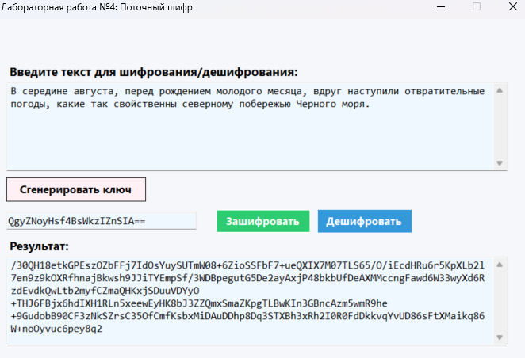
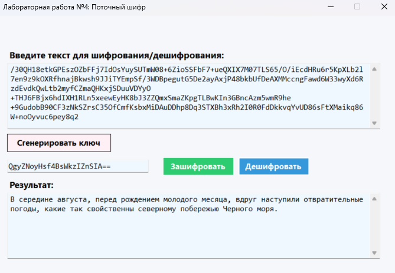

# Поточный шифр на основе генератора псевдослучайной последовательности

## Краткое описание метода шифрования

Данная программа реализует поточный шифр, использующий линейный конгруэнтный генератор (ЛКГ) для создания гаммы. Особенностью поточного шифрования является побитовое сложение открытого текста с псевдослучайной последовательностью (гаммой).

### Математическая основа
Генератор использует формулу:  
`Xₙ₊₁ = (1664525 * Xₙ + 1013904223) mod 2³²`

## Запуск проекта

Для запуска проекта выполните следующие шаги:

1. Убедитесь, что у вас установлен .NET 8.0 SDK
2. Откройте терминал и перейдите в корневую директорию проекта
3. Выполните команду: dotnet run

### Функциональность 

1. **Генерация ключа** - создание криптографически стойкого ключа длиной 16 байт.
2. **Шифрование текста** - преобразование открытого текста в шифротекст с использованием ключа.
3. **Дешифрование текста** - восстановление исходного текста из шифротекста с помощью того же ключа.

## Интерфейс программы

Программа предоставляет интуитивно понятный графический интерфейс с:
- Полем для ввода исходного текста или шифротекста
- Кнопкой генерации ключа
- Полем для отображения/ввода ключа
- Кнопками шифрования и дешифрования
- Полем для отображения результатов

## Особенности реализации

- Ключ хранится в формате Base64 для удобства использования
- Автоматическая проверка валидности вводимых данных

## Пример работы программы

### Шифрование текста

### Дешифрование текста  
