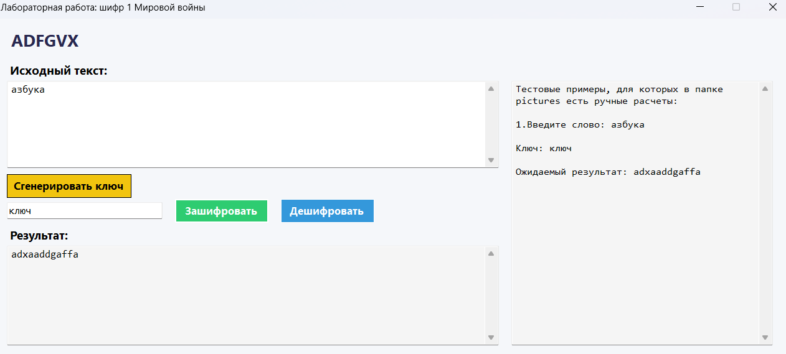
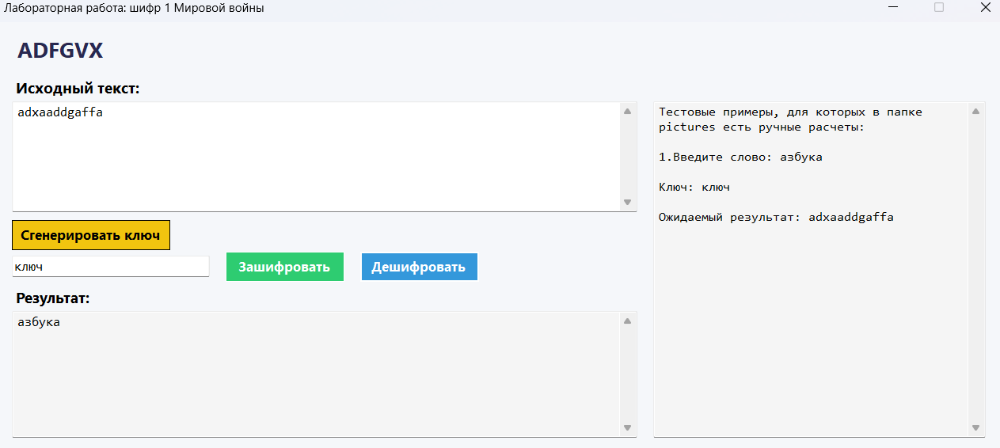
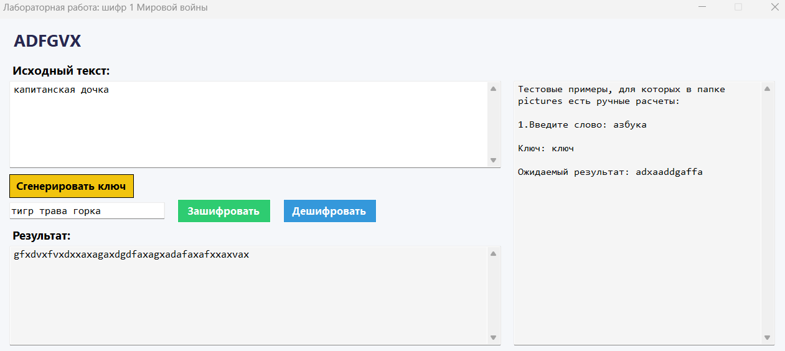
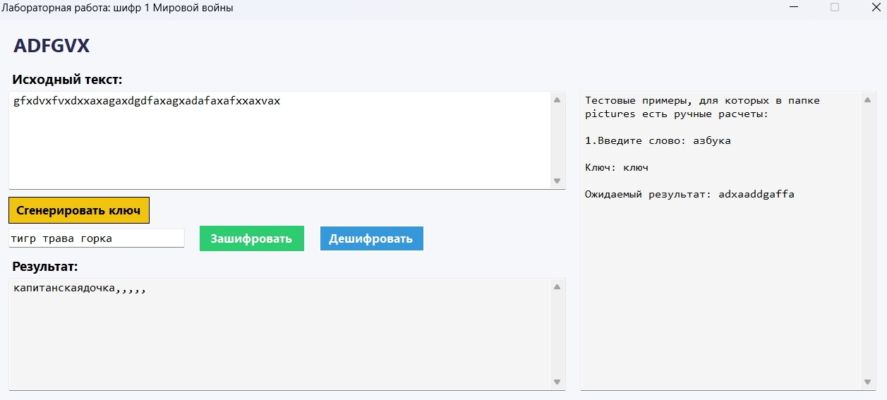
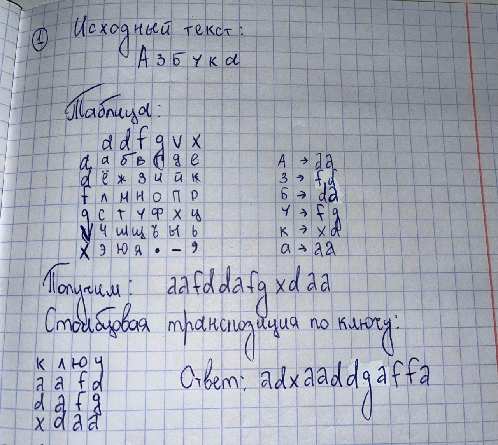

# Шифр ADFGVX

## Описание
Данная лабораторная работа демонстрирует шифрование методом ADFGVX. 

## Краткое описание метода шифрования ADFGVX
Шифр ADFGVX — это полевая шифровальная система, использовавшаяся немецкой армией во время Первой мировой войны. Он представляет собой комбинацию замены и перестановки. Шифр использует квадрат Виженера размером 6x6 для замены букв и цифр на пары символов из набора A, D, F, G, V, X. Затем эти пары символов подвергаются перестановке на основе ключевого слова.

## Запуск проекта
Для запуска проекта выполните следующие шаги:

1. Убедитесь, что у вас установлен .NET 8.0 SDK.
2. Откройте терминал и перейдите в корневую директорию проекта.
3. Выполните команду: dotnet run

### Что можно сделать в модальном окне?

1. Ввести текст для шифрования
2. Сгенерировать ключ или ввести его самому
3. Получить зашифрованный текст
4. Расшифровать текст, имея ключ

## Скриншоты

### Шифрование текста

### Дешифрование текста

### Шифрование текста

### Дешифрование текста

### Пример №1 ручного шифрования для проверки работы программы

