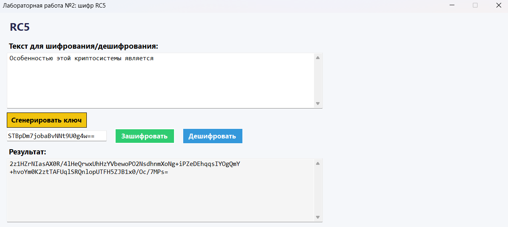
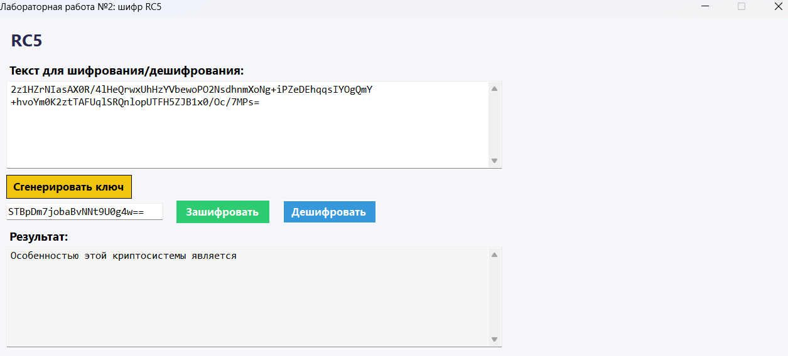
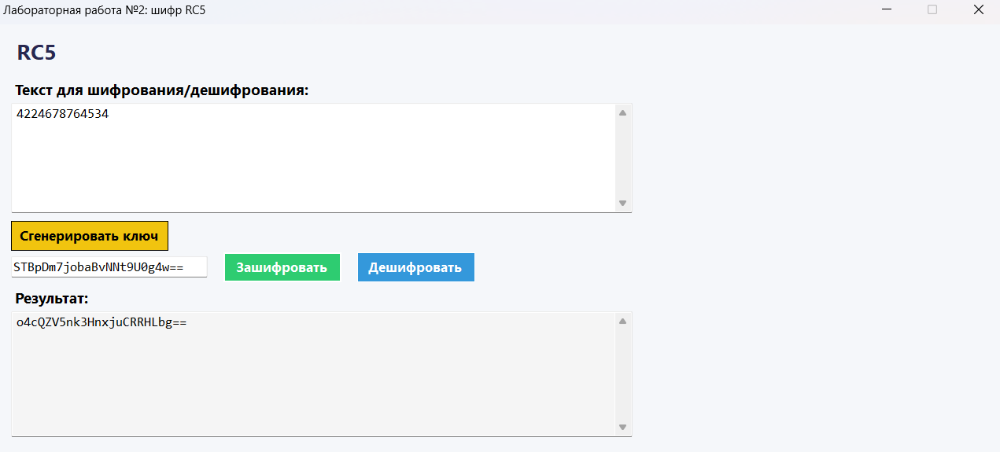
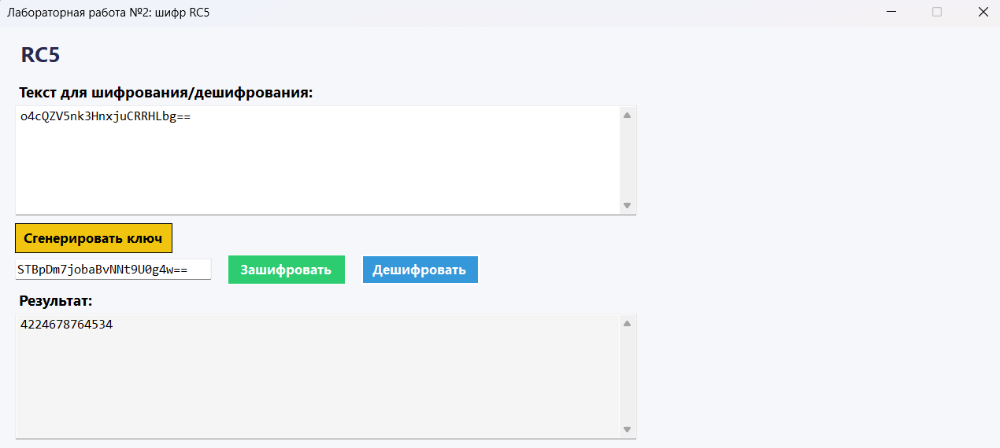

# Криптосистема RC5

## Краткое описание метода шифрования 
Особенностью этой криптосистемы является использование операций циклического сдвига, зависящих от преобразуемых данных RC5 [12,13]. Это задает непредопределенность операций преобразования, выполняемых над преобразуемыми подблоками данных, что по замыслу разработчиков должно привести к достижению высокой криптостойкости. В этой криптосистеме предусмотрена возможность задания пользователем числа раундов и размера входного блока данных. Входной блок разбивается на два подблока одинаковой длины. Обозначим длину подблока в битах через b. Шифрование заключается в поочередном преобразовании подблоков с использованием операций поразрядного суммирования по модулю два, суммирования по модулю 2^b и управляемых операций циклического сдвига. Варианты операции циклического сдвига различаются величиной сдвига от 0 до (b - 1) бит.

## Запуск проекта
Для запуска проекта выполните следующие шаги:

1. Убедитесь, что у вас установлен .NET 8.0 SDK.
2. Откройте терминал и перейдите в корневую директорию проекта.
3. Выполните команду: dotnet run

### Что можно сделать в модальном окне?

1. Ввести текст для шифрования
2. Сгенерировать ключ или ввести его самому
3. Получить зашифрованный текст
4. Расшифровать текст, имея ключ

## Скриншоты

### Шифрование текста

### Дешифрование текста

### Шифрование текста

### Дешифрование текста
